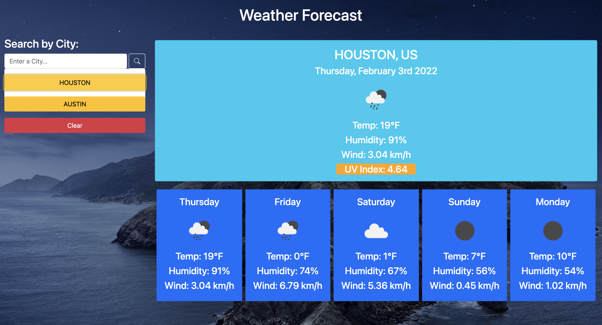

# weather-forecast

Application live URL: https://github.com/Houst29476/weather-forecast

GitHub Repository URL: https://houst29476.github.io/weather-forecast/

Create a weather outlook (forecaster) for multiple cities so a user can plan a trip accordingly:

    Functionality Requirements:
     - Input form for user to enter and search for a city
     - Present user with current and future conditions for that city
     - Add “searched” city to a search history
     - When viewing current weather for searched city
         * Present user with:
            - 5-day forecast
            - City name
            - Todays date
            - Icon representation of weather conditions
            - Temperature
            - Humidity
            - Wind speed
            - UV Index

     - When viewing the UV Index
         * Display color range that indicates (one of the following):
            - Favorable
            - Moderate
            - Severe

     - When a city is “clicked” in Search History
         * Display 5-day forecast (current and future weather)

